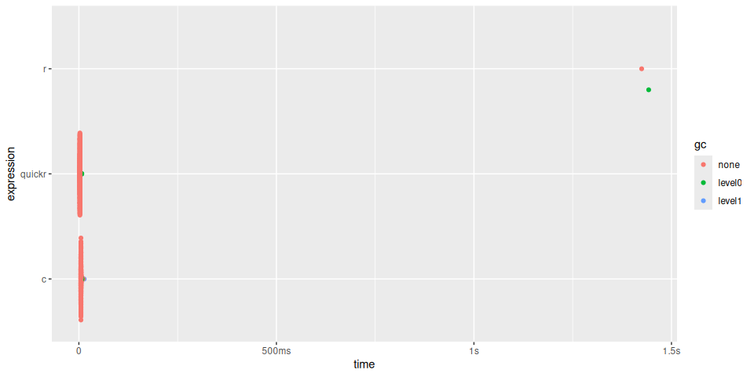
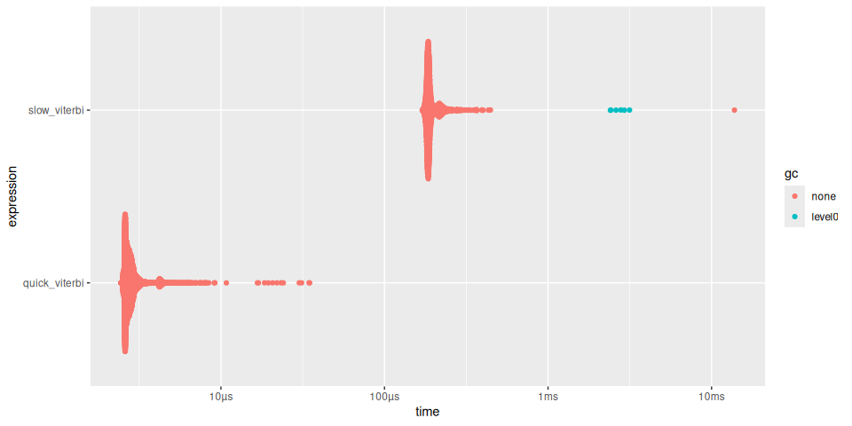
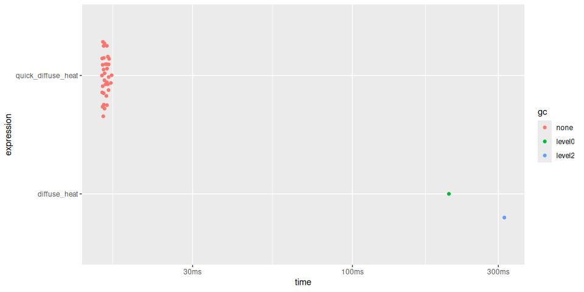
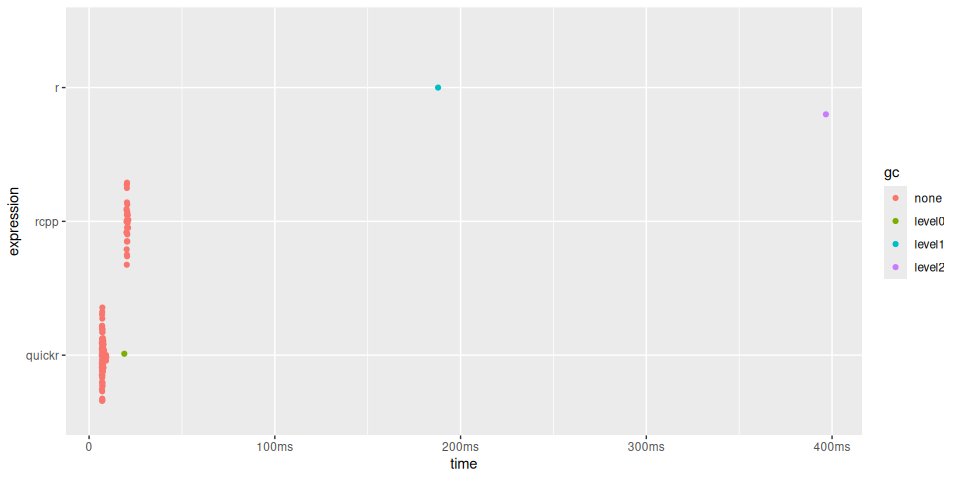
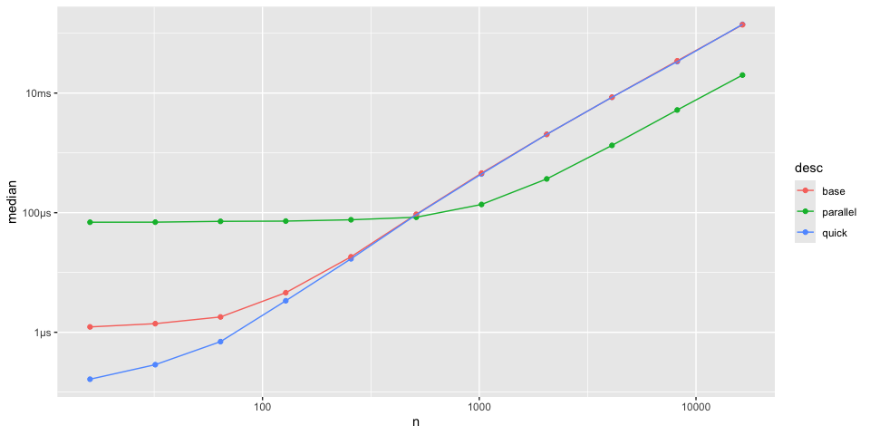

<!-- README.md is generated from README.Rmd. Please edit that file -->

# quickr 

<!-- {alt="An animated GIF showing two characters in a spaceship cockpit rapidly accelerating into hyperspace, with stars stretching into bright streaks, creating a sensation of rapid acceleration and motion."} -->

<!-- badges: start -->

[](https://github.com/t-kalinowski/quickr/actions/workflows/R-CMD-check.yaml)
[](https://app.codecov.io/gh/t-kalinowski/quickr)

<!-- badges: end -->

The goal of quickr is to make your R code run quicker.

## Overview

R is an extremely flexible and dynamic language, but that flexibility
and dynamicism can come at the expense of speed. This package lets you
trade back some of that flexibility for some speed, for the context of a
single function.

<!-- Programming language design requires some hard decisions and trade-ofs. -->

<!-- When you want to have it all, you typically end up have two (or more!) languages. -->

<!-- An interpreted, dynamic language full of conveniences, and a staticly-typed, explicit, high-performance language. -->

<!-- This is sometimes called the "Two Language Problem". -->

<!-- Like [Numba](https://numba.pydata.org) in Python, or the [Julia](https://julialang.org) language, quickr is a solution to the [two-language problem](https://juliadatascience.io/julia_accomplish). -->

<!-- Unlike those tools however, quickr does not bundle most of LLVM, keeping dependencies lightweight. -->

<!-- Quickr works by translating the R code to Fortran. -->

<!-- Fortran might seem like a surprising choice, but it has many compelling properties: -->

<!-- -   Superb performance. -->

<!--     As a stalwart of the numerical computing community, Fortran has accrued the benefit of countless person-hours from top-tier computer scientists and compiler engineers. -->

<!--     There is a reason that over 20% of R itself, (and numpy, and ...) are still in Fortran, and it's not merely because of legacy. -->

<!--     And this trend of compiler engineers focusing on Fortran is not stopping. -->

<!-- -   Large overlap with R semantics and syntax for numerical computing. -->

<!--     Fortran and R have very similar syntax for operating on arrays. -->

<!--     Like R, Fortran has builtin-in support for nd-arrays, provides vectorized operators on arrays, convenient array slicing semantics that match many capabilities of R's `[` , 1-based indexing, and a well-populated collection of operators for working on those arrays like `min`, `max`, `any` `all`, etc. -->

<!--     This means that it's relatively straightforward to translate R to Fortran, often just a 1:1 mapping of semantics, with some changes to syntax. -->

<!--     This is also why Fortran has such superb performance, and why it attracts compiler engineers to work on it. -->

<!--     Because the language spec guarantees things like, static shapes for nd-arrays, views of those arrays, etc, it provides many opportunities for compiler engineers to do things like generate SIMD instructions, or automatically parallelize code. -->

<!-- -   Excellent support in R. -->

<!--     One of the original motivations for R was to serve as a front-end for Fortran. -->

<!--     Since its inception, R has supported Fortran extensions, and supported them well. -->

<!--     It also means that any computing environment where R build tools are available, Fortran is supported. -->

<!--     The barrier to entry and thorny questions, that, for example, using Rust in CRAN might raise, is non-existent for Fortran. -->

The main exported function is `quick()`, here is how you use it.

``` r
library(quickr)

convolve <- quick(function(a, b) {
  declare(type(a = double(NA)),
          type(b = double(NA)))
  ab <- double(length(a) + length(b) - 1)
  for (i in seq_along(a)) {
    for (j in seq_along(b)) {
      ab[i+j-1] <- ab[i+j-1] + a[i] * b[j]
    }
  }
  ab
})
```

`quick()` returns a quicker R function. How much quicker? Let’s
benchmark it! For reference, we’ll also compare it to a
[pure-C](https://cran.r-project.org/doc/FAQ/R-exts.html#Calling-_002eCall-1)
implementation.

``` r
slow_convolve <- function(a, b) {
  declare(type(a = double(NA)),
          type(b = double(NA)))
  ab <- double(length(a) + length(b) - 1)
  for (i in seq_along(a)) {
    for (j in seq_along(b)) {
      ab[i+j-1] <- ab[i+j-1] + a[i] * b[j]
    }
  }
  ab
}

library(quickr)
quick_convolve <- quick(slow_convolve)

convolve_c <- inline::cfunction(
  sig = c(a = "SEXP", b = "SEXP"), body = r"({
    int na, nb, nab;
    double *xa, *xb, *xab;
    SEXP ab;

    a = PROTECT(Rf_coerceVector(a, REALSXP));
    b = PROTECT(Rf_coerceVector(b, REALSXP));
    na = Rf_length(a); nb = Rf_length(b); nab = na + nb - 1;
    ab = PROTECT(Rf_allocVector(REALSXP, nab));
    xa = REAL(a); xb = REAL(b); xab = REAL(ab);
    for(int i = 0; i < nab; i++) xab[i] = 0.0;
    for(int i = 0; i < na; i++)
        for(int j = 0; j < nb; j++)
            xab[i + j] += xa[i] * xb[j];
    UNPROTECT(3);
    return ab;
})")


a <- runif (100000); b <- runif (100)

timings <- bench::mark(
  r = slow_convolve(a, b),
  quickr = quick_convolve(a, b),
  c = convolve_c(a, b),
  min_time = 2
)
timings
#> # A tibble: 3 × 6
#>   expression      min   median `itr/sec` mem_alloc `gc/sec`
#>   <bch:expr> <bch:tm> <bch:tm>     <dbl> <bch:byt>    <dbl>
#> 1 r             1.22s    1.22s     0.819     782KB    0.819
#> 2 quickr       1.89ms   2.22ms   467.        782KB   10.2  
#> 3 c            4.21ms   4.49ms   227.        782KB    5.22
plot(timings) + bench::scale_x_bench_time(base = NULL)
```



In the case of `convolve()`, `quick()` returns a function approximately
*200* times quicker, giving similar performance to the C function.

`quick()` can accelerate any R function, with some restrictions:

- Function arguments must have their types and shapes declared using
  `declare()`.
- Only atomic vectors, matrices, and array are currently supported:
  `integer`, `double`, `logical`, and `complex`.
- The return value must be an atomic array (e.g., not a list)
- Named variables must have consistent shapes throughout their
  lifetimes.
- `NA` values are not supported.
- Only a subset of R’s vocabulary is currently supported.

<!-- -->

    #>  [1] -            :            !            !=           (           
    #>  [6] [            [<-          [<<-         {            *           
    #> [11] /            &            &&           %*%          %/%         
    #> [16] %%           %o%          ^            +            <           
    #> [21] <-           <<-          <=           =            ==          
    #> [26] >            >=           |            ||           Arg         
    #> [31] Conj         Fortran      Im           Mod          Re          
    #> [36] abs          acos         array        as.double    asin        
    #> [41] atan         backsolve    break        c            cat         
    #> [46] cbind        ceiling      character    chol         chol2inv    
    #> [51] cos          crossprod    declare      diag         dim         
    #> [56] double       exp          floor        for          forwardsolve
    #> [61] if           ifelse       integer      length       log         
    #> [66] log10        logical      matrix       max          min         
    #> [71] ncol         next         nrow         numeric      outer       
    #> [76] print        prod         raw          rbind        repeat      
    #> [81] runif        seq          seq_along    seq_len      sin         
    #> [86] solve        sqrt         sum          t            tan         
    #> [91] tcrossprod   which.max    which.min    while

Many of these restrictions are expected to be relaxed as the project
matures. However, quickr is intended primarily for high-performance
numerical computing, so features like polymorphic dispatch or support
for complex or dynamic types are out of scope.

## `declare(type())` syntax:

The shape and mode of all function arguments must be declared. Local and
return variables may optionally also be declared.

`declare(type())` also has support for declaring size constraints, or
size relationships between variables. Here are some examples of declare
calls:

``` r
declare(type(x = double(NA))) # x is a 1-d double vector of any length
declare(type(x = double(10))) # x is a 1-d double vector of length 10
declare(type(x = double(1)))  # x is a scalar double

declare(type(x = integer(2, 3)))  # x is a 2-d integer matrix with dim (2, 3)
declare(type(x = integer(NA, 3))) # x is a 2-d integer matrix with dim (<any>, 3)

# x is a 4-d logical matrix with dim (<any>, 24, 24, 3)
declare(type(x = logical(NA, 24, 24, 3)))

# x and y are 1-d double vectors of any length
declare(type(x = double(NA)),
        type(y = double(NA)))

# x and y are 1-d double vectors of the same length
declare(
  type(x = double(n)),
  type(y = double(n)),
)

# x and y are 1-d double vectors, where length(y) == length(x) + 2
declare(type(x = double(n)),
        type(y = double(n+2)))
```

## More examples:

### `viterbi`

The Viterbi algorithm is an example of a dynamic programming algorithm
within the family of Hidden Markov Models
(<https://en.wikipedia.org/wiki/Viterbi_algorithm>). Here, `quick()`
makes the `viterbi()` approximately 50 times faster.

``` r
slow_viterbi <- function(observations, states, initial_probs, transition_probs, emission_probs) {
    declare(
      type(observations = integer(num_steps)),
      type(states = integer(num_states)),
      type(initial_probs = double(num_states)),
      type(transition_probs = double(num_states, num_states)),
      type(emission_probs = double(num_states, num_obs)),
    )

    trellis <- matrix(0, nrow = length(states), ncol = length(observations))
    backpointer <- matrix(0L, nrow = length(states), ncol = length(observations))
    trellis[, 1] <- initial_probs * emission_probs[, observations[1]]

    for (step in 2:length(observations)) {
      for (current_state in 1:length(states)) {
        probabilities <- trellis[, step - 1] * transition_probs[, current_state]
        trellis[current_state, step] <- max(probabilities) * emission_probs[current_state, observations[step]]
        backpointer[current_state, step] <- which.max(probabilities)
      }
    }

    path <- integer(length(observations))
    path[length(observations)] <- which.max(trellis[, length(observations)])
    for (step in seq(length(observations) - 1, 1)) {
      path[step] <- backpointer[path[step + 1], step + 1]
    }

    out <- states[path]
    out
}

quick_viterbi <- quick(slow_viterbi)

set.seed(1234)
num_steps <- 16
num_states <- 8
num_obs <- 16

observations <- sample(1:num_obs, num_steps, replace = TRUE)
states <- 1:num_states
initial_probs <- runif (num_states)
initial_probs <- initial_probs / sum(initial_probs)  # normalize to sum to 1
transition_probs <- matrix(runif (num_states * num_states), nrow = num_states)
transition_probs <- transition_probs / rowSums(transition_probs)  # normalize rows
emission_probs <- matrix(runif (num_states * num_obs), nrow = num_states)
emission_probs <- emission_probs / rowSums(emission_probs)  # normalize rows

timings <- bench::mark(
  slow_viterbi = slow_viterbi(observations, states, initial_probs,
                              transition_probs, emission_probs),
  quick_viterbi = quick_viterbi(observations, states, initial_probs,
                                transition_probs, emission_probs)
)
timings
#> # A tibble: 2 × 6
#>   expression         min   median `itr/sec` mem_alloc `gc/sec`
#>   <bch:expr>    <bch:tm> <bch:tm>     <dbl> <bch:byt>    <dbl>
#> 1 slow_viterbi  202.52µs 213.73µs     4231.    1.59KB     12.6
#> 2 quick_viterbi   2.26µs   2.39µs   405918.        0B      0
plot(timings)
```



### Diffusion simulation

Simulate how heat spreads over time across a 2D grid, using the [finite
difference method](https://en.wikipedia.org/wiki/Finite_difference)
applied to the [Heat
Equation](https://en.wikipedia.org/wiki/Heat_equation).

Here, `quick()` returns a function over 100 times faster.

``` r
diffuse_heat <- function(nx, ny, dx, dy, dt, k, steps) {
  declare(
    type(nx = integer(1)),
    type(ny = integer(1)),
    type(dx = integer(1)),
    type(dy = integer(1)),
    type(dt = double(1)),
    type(k = double(1)),
    type(steps = integer(1))
  )

  # Initialize temperature grid
  temp <- matrix(0, nx, ny)
  temp[nx / 2, ny / 2] <- 100  # Initial heat source in the center

  # Local helper that updates `temp` in-place.
  apply_boundary_conditions <- function() {
    temp[1, ] <<- 0
    temp[nx, ] <<- 0
    temp[, 1] <<- 0
    temp[, ny] <<- 0
    NULL
  }

  update_temperature <- function(temp, k, dx, dy, dt) {
    temp_new <- temp
    for (i in 2:(nx - 1)) {
      for (j in 2:(ny - 1)) {
        temp_new[i, j] <- temp[i, j] + k * dt *
          ((temp[i + 1, j] - 2 * temp[i, j] + temp[i - 1, j]) / dx ^ 2 +
             (temp[i, j + 1] - 2 * temp[i, j] + temp[i, j - 1]) / dy ^ 2)
      }
    }
    temp_new
  }

  # Time stepping
  for (step in seq_len(steps)) {
    apply_boundary_conditions()
    temp <- update_temperature(temp, k, dx, dy, dt)
  }

  temp
}

quick_diffuse_heat <- quick(diffuse_heat)

# Parameters
nx <- 100L      # Grid size in x
ny <- 100L      # Grid size in y
dx <- 1L        # Grid spacing
dy <- 1L        # Grid spacing
dt <- 0.01      # Time step
k <- 0.1        # Thermal diffusivity
steps <- 500L   # Number of time steps

timings <- bench::mark(
  diffuse_heat = diffuse_heat(nx, ny, dx, dy, dt, k, steps),
  quick_diffuse_heat = quick_diffuse_heat(nx, ny, dx, dy, dt, k, steps)
)
#> Warning: Some expressions had a GC in every iteration; so filtering is
#> disabled.
summary(timings, relative = TRUE)
#> Warning: Some expressions had a GC in every iteration; so filtering is
#> disabled.
#> # A tibble: 2 × 6
#>   expression           min median `itr/sec` mem_alloc `gc/sec`
#>   <bch:expr>         <dbl>  <dbl>     <dbl>     <dbl>    <dbl>
#> 1 diffuse_heat        224.   219.        1       514.      Inf
#> 2 quick_diffuse_heat    1      1       220.        1       NaN
plot(timings)
```



### Rolling Mean

Here is quickr used to calculate a rolling mean. Note that the CRAN
package RcppRoll already provides a highly optimized rolling mean, which
we include in the benchmarks for comparison.

``` r
slow_roll_mean <- function(x, weights, normalize = TRUE) {
  declare(
    type(x = double(NA)),
    type(weights = double(NA)),
    type(normalize = logical(1))
  )
  out <- double(length(x) - length(weights) + 1)
  n <- length(weights)
  if (normalize)
    weights <- weights/sum(weights)*length(weights)

  for(i in seq_along(out)) {
    out[i] <- sum(x[i:(i+n-1)] * weights) / length(weights)
  }
  out
}

quick_roll_mean <- quick(slow_roll_mean)

x <- dnorm(seq(-3, 3, len = 100000))
weights <- dnorm(seq(-1, 1, len = 100))

timings <- bench::mark(
  r = slow_roll_mean(x, weights),
  rcpp = RcppRoll::roll_mean(x, weights = weights),
  quickr = quick_roll_mean(x, weights = weights)
)
#> Warning: Some expressions had a GC in every iteration; so filtering is
#> disabled.
timings
#> # A tibble: 3 × 6
#>   expression      min   median `itr/sec` mem_alloc `gc/sec`
#>   <bch:expr> <bch:tm> <bch:tm>     <dbl> <bch:byt>    <dbl>
#> 1 r          160.42ms 173.12ms      5.54  124.24MB    14.8 
#> 2 rcpp        25.56ms  25.89ms     38.8     4.46MB     0   
#> 3 quickr       6.07ms   6.36ms    154.    781.35KB     3.99

timings$expression <- factor(names(timings$expression), rev(names(timings$expression)))
plot(timings) + bench::scale_x_bench_time(base = NULL)
```



## Parallelize loops with OpenMP

Use `declare(parallel())` to annotate the next `for` loop or `sapply()`
call for OpenMP parallelization. Parallel loops must be
order-independent: avoid shared-state updates or inter-iteration
dependencies. OpenMP adds overhead, so it can be slower for small
workloads, but substantially faster for larger ones.

Here is a concrete example using `colSums()`. At smaller sizes, the
quickr serial version is fastest (even faster than base `colSums()`). As
sizes grow, the two serial versions converge, and the parallel version
pulls ahead. However, the speedup is not linear with core count (e.g.,
with 12 cores, the speedup is closer to ~6x).

``` r
colSums_quick_parallel <- quick(function(x) {
  declare(type(x = double(NA, NA)))
  declare(parallel())
  sapply(seq_len(nrow(x)), \(r) sum(x[, r]))
})

colSums_quick <- quick(function(x) {
  declare(type(x = double(NA, NA)))
  sapply(seq_len(nrow(x)), \(r) sum(x[, r]))
})

r <- bench::press(
  n = 2^(4:14),
  {
    m <- array(runif(n * n), c(n, n))
    bench::mark(
      parallel = colSums_quick_parallel(m),
      quick = colSums_quick(m),
      base = colSums(m),
    )
  },
  .quiet = TRUE
)

library(ggplot2)
library(dplyr, warn.conflicts = FALSE)

r |>
  mutate(.before = 1,
         desc = attr(expression, "description")) |>
  select(desc, n, median) |>
  ggplot(aes(x = n, y = median, color = desc)) +
  geom_point() + geom_line() +
  scale_x_log10() + bench::scale_y_bench_time()
```



quickr does not set OpenMP thread counts. To control threads, set
`OMP_NUM_THREADS` (and optionally `OMP_THREAD_LIMIT` or `OMP_DYNAMIC`)
before calling a compiled function,
e.g. `Sys.setenv(OMP_NUM_THREADS = "4")`.

## Using `quickr` in an R package

When called in a package, `quick()` will pre-compile the quick functions
and place them in the `./src` directory. Run `devtools::load_all()` or
`quickr::compile_package()` to ensure that the generated files in
`./src` and `./R` are in sync with each other.

In a package, you must provide a function name to `quick()`. For
example:

``` r
my_fun <- quick(name = "my_fun", function(x) ....)
```

## Basic support for matrix operations

We have implemented a subset of matrix operations from base R. When you
do a matrix multiplication like `A %*% B`, R calls BLAS/LAPACK functions
linked to your R build. `quickr` is linked to the same BLAS/LAPACK
implementation, so you can expect the same results and slightly faster
computation due to lower overhead. There are multiple BLAS/LAPACK
implementations, and performance therefore depends on what you have
installed.

To illustrate the performance of matrix operations, we do a linear
regression using the normal equation, which is fast but not the most
numerically stable method. We compare with `RcppArmadillo`, which is a
popular library for matrix operations. The `RcppArmadillo`
implementation aims to match our R implementation.

``` r
lm <- function(X, y) {
  declare(
    type(X = double(n, k)), 
    type(y = double(n))
  )

  df <- nrow(X) - ncol(X)

  XtX <- crossprod(X)
  Xty <- crossprod(X, y)
  coef <- solve(XtX, Xty)
  fit_val <- X %*% coef
  resid <- y - fit_val
  s2 <- crossprod(resid)[1]
  s2 <- s2 / df

  U <- chol(XtX)
  XtX_inv <- chol2inv(U)
  std_err <- sqrt(diag(XtX_inv) * s2)

  list(
    coefficients  = coef,
    stderr        = std_err,
    df.residual   = df,
    fitted_values = fit_val,
    residuals     = resid
  )
}

qlm <- quick(lm)

Rcpp::sourceCpp(
  code = '#include <RcppArmadillo.h>
// [[Rcpp::depends(RcppArmadillo)]]

// [[Rcpp::export]]
Rcpp::List RcppLm(const arma::mat& X, const arma::colvec& y) {
    int n = X.n_rows;
    int k = X.n_cols;
    int df = n - k;
    
    arma::mat XtX = arma::trans(X) * X;
    arma::colvec Xty = arma::trans(X) * y;
    arma::colvec coef = arma::solve(XtX, Xty);
    arma::colvec fit_val = X * coef;
    arma::colvec resid = y - fit_val;
    double s2 = arma::dot(resid, resid);
    s2 = s2 / df;
    
    arma::mat U = arma::chol(XtX);
    arma::mat XtX_inv = arma::inv(arma::trimatu(U)) * arma::trans(arma::inv(arma::trimatu(U)));
    arma::colvec std_err = arma::sqrt(arma::diagvec(XtX_inv) * s2);
    
    return Rcpp::List::create(
        Rcpp::Named("coefficients")  = coef,
        Rcpp::Named("stderr")        = std_err,
        Rcpp::Named("df.residual")   = df,
        Rcpp::Named("fitted_values") = fit_val,
        Rcpp::Named("residuals")     = resid
    );
}'
)

beta <- c(0.5, 1.0, -2.0, 10, 5)
X <- cbind(1, matrix(rnorm(3 * 10^6), ncol = 4))
y <- as.vector(X %*% beta + rnorm(nrow(X), sd = 2))

timings <- bench::mark(
  r = lm(X, y),
  quickr = qlm(X, y),
  RcppArmadillo = RcppLm(X, y),
  check = FALSE, # stderr is a vector in R and matrix in RcppArmadillo
  min_iterations = 30
)
timings
#> # A tibble: 3 × 6
#>   expression         min   median `itr/sec` mem_alloc `gc/sec`
#>   <bch:expr>    <bch:tm> <bch:tm>     <dbl> <bch:byt>    <dbl>
#> 1 r               21.5ms     22ms      44.9    11.4MB     0   
#> 2 quickr          14.4ms   14.6ms      67.3    11.4MB     2.04
#> 3 RcppArmadillo   15.3ms     25ms      42.3    11.4MB     0
```

## Installation

You can install quickr from CRAN with:

``` r
install.packages("quickr")
```

You can install the development version of quickr from
[GitHub](https://github.com/) with:

``` r
# install.packages("pak")
pak::pak("t-kalinowski/quickr")
```

You will also need a C and Fortran compiler, preferably the same ones
used to build R itself.

On macOS:

- Make sure xcode tools and gfortran are installed, as described in
  <https://mac.r-project.org/tools/>. In Terminal, run:

  ``` zsh
  sudo xcode-select --install
  # curl -LO https://mac.r-project.org/tools/gfortran-12.2-universal.pkg # R 4.4
  curl -LO https://mac.r-project.org/tools/gfortran-14.2-universal.pkg   # R 4.5
  sudo installer -pkg gfortran-12.2-universal.pkg -target /
  ```

- Optional: install `flang-new` via Homebrew (used by quickr on macOS
  when available):

  ``` zsh
  brew install flang
  ```

On Windows:

- Install the latest version of
  [Rtools](https://cran.r-project.org/bin/windows/Rtools/)

On Linux:

- The “Install Required Dependencies” section
  [here](https://docs.posit.co/resources/install-r-source.html#install-required-dependencies)
  provides detailed instructions for installing R build tools on various
  Linux flavors.
